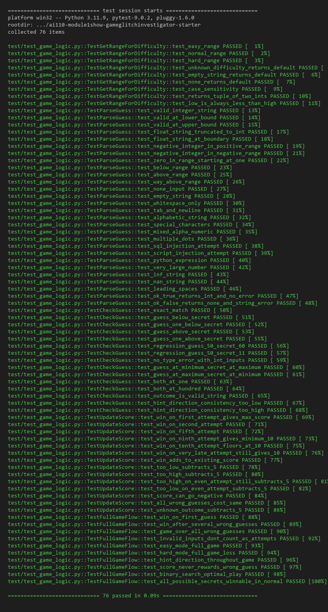

# 🎮 Game Glitch Investigator: The Impossible Guesser

## 🚨 The Situation

You asked an AI to build a simple "Number Guessing Game" using Streamlit.
It wrote the code, ran away, and now the game is unplayable.

- You can't win.
- The hints lie to you.
- The secret number seems to have commitment issues.

## 🛠️ Setup

1. Install dependencies: `pip install -r requirements.txt`
2. Run the fixed app: `python -m streamlit run app.py`

## 🕵️‍♂️ Your Mission

1. **Play the game.** Open the "Developer Debug Info" tab in the app to see the secret number. Try to win.
2. **Find the State Bug.** Why does the secret number change every time you click "Submit"? Ask ChatGPT: *"How do I keep a variable from resetting in Streamlit when I click a button?"*
3. **Fix the Logic.** The hints ("Higher/Lower") are wrong. Fix them.
4. **Refactor & Test.** - Move the logic into `logic_utils.py`.
   - Run `pytest` in your terminal.
   - Keep fixing until all tests pass!

## 📝 Document Your Experience

- [x] Describe the game's purpose.
- [x] Detail which bugs you found.
- [x] Explain what fixes you applied.

**What the game does:** It is a number guessing game built with Streamlit. You pick a difficulty, the app picks a random secret number, and you try to guess it within a limited number of attempts. After each guess it tells you to go higher or lower.

**Bugs I found:**
1. **Inverted hints** — When I guessed 50 and the secret was 60, it told me to go LOWER instead of higher. The root cause was two things working together: the outcome labels in `check_guess()` were swapped, and the code was converting the secret to a string on even attempts, which caused Python to do ASCII comparison instead of numeric comparison.
2. **Double-submit required** — I had to click Submit twice because the text input and button were separate Streamlit widgets, causing two reruns instead of one.
3. **New Game broken** — Pressing New Game never reset `status` back to "playing" or cleared the history, so it kept saying "You already won" even after clicking it.
4. **Attempts started at 1** instead of 0, throwing off the count and triggering the string bug on the very first guess.
5. **Invalid input wasted turns** — Typing garbage incremented the attempt counter before validation.
6. **Wrong scoring** — Wrong "Too High" guesses gave +5 points on even attempts instead of -5.
7. **Hardcoded range** — The info bar always said "between 1 and 100" regardless of difficulty.

**Fixes applied:** Refactored all logic into `logic_utils.py`, fixed `check_guess()` labels, removed the string conversion path, wrapped input in `st.form()`, reset all session state on New Game, moved attempt increment after validation, and made the display use the actual difficulty range. Wrote 76 pytest cases to lock it all down.

## 📸 Demo

## 🚀 Stretch Features

- [ ] [If you choose to complete Challenge 4, insert a screenshot of your Enhanced Game UI here]
