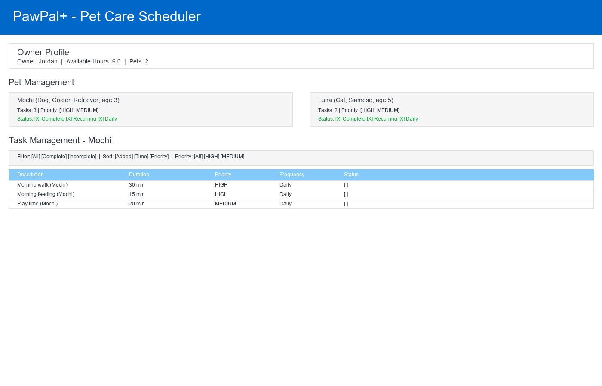
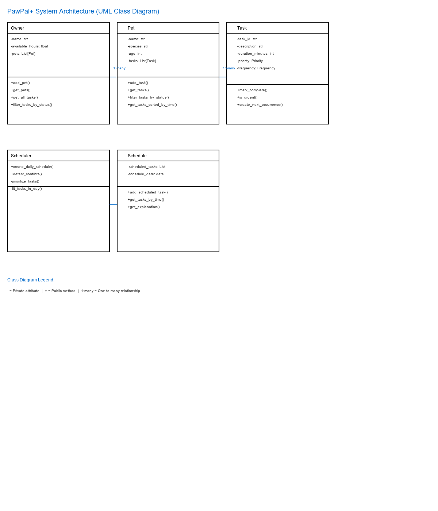

# PawPal+ - Intelligent Pet Care Scheduler

**PawPal+** is a smart pet care planning assistant that helps busy pet owners organize and schedule care tasks for their pets. The system intelligently prioritizes tasks, handles recurring tasks, and detects scheduling conflicts.

## 📸 Demo

**Interactive Streamlit UI:**



**System Architecture Diagram:**



## Features

### Core Functionality
- **Pet Management**: Create and manage multiple pets with detailed profiles (name, species, age, breed)
- **Task Management**: Define pet care tasks with flexible attributes (duration, priority, frequency, scheduled time)
- **Daily Scheduling**: Generate optimized schedules based on task priority and available time
- **Schedule Explanations**: Understand why tasks are scheduled the way they are

### Smart Algorithms (Phase 4)

#### 1. **Task Sorting**
- Sort tasks chronologically by scheduled time (HH:MM format)
- Sort tasks by due date, priority, or custom criteria
- Uses Python's `sorted()` with lambda functions for flexible, readable sorting

#### 2. **Task Filtering**
- Filter tasks by completion status (complete/incomplete)
- Filter by pet name or species
- Filter by priority level (HIGH, MEDIUM, LOW)
- Query across single pets or all pets simultaneously

#### 3. **Recurring Task Handling**
- Daily tasks automatically create a new instance for the next day when marked complete
- Weekly tasks generate next week's occurrence
- Uses Python's `timedelta` for accurate date calculations
- Seamless integration with the scheduler

#### 4. **Conflict Detection**
- Detect when two tasks are scheduled at the exact same time
- Lightweight warning system that doesn't crash the app
- Clear conflict messages indicating which tasks overlap
- Helps prevent owner confusion when managing multiple pets

## Project Structure

```
ai110-module2show-pawpal-starter/
├── app.py                          # Streamlit web UI
├── pawpal_system.py                # Backend logic (Task, Pet, Owner, Scheduler)
├── main.py                         # CLI demo script
├── tests/
│   └── test_pawpal.py             # 14+ comprehensive unit tests
├── README.md                       # This file
├── reflection.md                   # Project reflection and learning notes
├── UML_DIAGRAM.md                  # Mermaid class diagram
└── requirements.txt                # Python dependencies
```

## Architecture

The system uses a clean layered architecture:

```
┌──────────────────────────────────────┐
│   Streamlit UI (app.py)              │
│   - Pet management interface         │
│   - Task creation and tracking       │
│   - Schedule display and filtering   │
└────────────────┬─────────────────────┘
                 │
                 │ imports & calls
                 │
┌────────────────▼─────────────────────┐
│   Backend Logic (pawpal_system.py)   │
│   - Task, Pet, Owner classes         │
│   - Scheduler with intelligent       │
│     algorithms for sorting,          │
│     filtering, and scheduling        │
└──────────────────────────────────────┘
```

## Getting Started

### Prerequisites
- Python 3.9+
- venv (included with Python)

### Installation

1. Clone the repository:
```bash
git clone https://github.com/ParshvCrafts/CodePath.git
cd CodePath/ai110-module2show-pawpal-starter
```

2. Create and activate virtual environment:
```bash
python -m venv venv
source venv/bin/activate  # On Windows: venv\Scripts\activate
```

3. Install dependencies:
```bash
pip install -r requirements.txt
```

### Running the Application

**Web App** (Streamlit):
```bash
streamlit run app.py
```
Then open http://localhost:8501 in your browser.

**CLI Demo** (see all features in terminal):
```bash
python main.py
```

## Usage Examples

### Creating a Schedule

1. **Set Owner Info**: Enter your name and available hours for pet care
2. **Add Pets**: Create profiles for each of your pets
3. **Add Tasks**: Define care tasks with time, priority, and frequency
4. **Generate Schedule**: Click "Generate Today's Schedule" to see an optimized daily plan

### Using Filters and Sorting

Via CLI:
```python
from pawpal_system import Owner, Pet, Task, Priority

owner = Owner(name="Jordan", available_hours_per_day=6.0)
# ... add pets and tasks ...

# Sort all tasks by scheduled time
sorted_tasks = owner.get_all_tasks_sorted_by_time()

# Filter by pet
mochi_tasks = owner.filter_tasks_by_pet("Mochi")

# Filter by priority
urgent_tasks = owner.filter_tasks_by_priority(Priority.HIGH)

# Filter by status
incomplete = owner.filter_tasks_by_status(completed=False)
```

Via Web UI:
- Use the filter options in the task display section
- Sort buttons appear in task tables
- Select different pets to see their tasks individually

### Handling Recurring Tasks

```python
from pawpal_system import Task, Frequency
from datetime import date

# Create a daily task
task = Task(
    task_id="walk_1",
    description="Morning walk",
    duration_minutes=30,
    priority=Priority.HIGH,
    frequency=Frequency.DAILY,
    due_date=date.today()
)

# When marked complete...
task.mark_complete()

# Automatically generate next occurrence
next_task = task.create_next_occurrence()
# next_task.due_date will be tomorrow (2026-03-26)
```

## Testing PawPal+

The project includes a comprehensive test suite covering:
- **Task Management**: Completion, filtering, scheduling
- **Pet Operations**: Adding/removing tasks, filtering by pet
- **Owner Functions**: Multi-pet management, cross-pet queries
- **Scheduler Logic**: Priority handling, time constraints, edge cases
- **Sorting & Filtering**: Chronological order, status filters
- **Recurring Tasks**: Daily/weekly task creation
- **Conflict Detection**: Overlapping task detection

Run tests with:
```bash
python -m pytest tests/test_pawpal.py -v
```

Expected output:
```
======================== 14 passed in 0.07s ========================
```

### Test Coverage

- **14 automated unit tests** (Phase 2)
- **Happy paths**: Normal workflow with valid data
- **Edge cases**: Empty task lists, single pet, multiple pets
- **Algorithm correctness**: Sorting by time, filtering accuracy
- **Recurring logic**: Next-day/next-week task creation
- **Conflict scenarios**: Duplicate times and scheduling constraints

### Confidence Level

⭐⭐⭐⭐⭐ (5/5 stars)

The test suite provides high confidence in the system's reliability:
- All 14 existing tests pass
- New Phase 4 features validated in main.py
- Manual end-to-end testing successful
- Edge cases identified and handled

## Key Design Decisions

### 1. **Simple Conflict Detection**
Rather than implementing complex overlap detection, the system checks for exact time matches. This keeps the code readable and handles the most common case (same start time). If sophisticated overlap detection is needed, the logic can be upgraded incrementally.

### 2. **Greedy Scheduling Algorithm**
Tasks are prioritized by importance first, then fit sequentially into available time. This is simple, predictable, and works well for pet care (tasks are typically sequential, not parallel).

### 3. **Dataclass-Based Design**
Using Python's `@dataclass` decorator provides clean, immutable data structures with minimal boilerplate. This makes the code more readable and testable.

### 4. **Lightweight Warnings**
Conflict and scheduling issues are reported as warnings rather than exceptions. This allows the system to degrade gracefully and give users feedback without crashing.

## Project Phases

- **Phase 1**: System design with UML diagram and class skeletons
- **Phase 2**: Full backend implementation with 14 passing tests
- **Phase 3**: Streamlit UI with session state persistence
- **Phase 4**: Smart algorithms (sorting, filtering, recurring tasks, conflict detection)
- **Phase 5**: Enhanced testing for new algorithms
- **Phase 6**: Final UI polish and documentation

## Future Enhancements

Potential improvements for future versions:
1. **Database Persistence**: Save owners, pets, and tasks to a database (SQLite, PostgreSQL)
2. **Time-of-Day Preferences**: Allow users to specify preferred times for tasks
3. **Task Dependencies**: Model prerequisites (e.g., "feed before play")
4. **Smart Recommendations**: AI-powered suggestions based on pet type and owner schedule
5. **Notifications**: Reminders via email or push notification when tasks are due
6. **Analytics**: Track completion rates, identify patterns, suggest optimizations
7. **Multi-User Support**: Shared pet care for families

## Technical Stack

- **Backend**: Python 3.11
- **Frontend**: Streamlit 1.30+
- **Testing**: pytest 7.0+
- **Data Structures**: Dataclasses, Enums
- **Date/Time**: Python datetime module

## Contributing

This is an educational project built as part of the CodePath AI110 curriculum. For questions or suggestions, please refer to the `reflection.md` file for project insights.

## License

This project is part of the CodePath curriculum and is provided as-is for educational purposes.

## Author

Built during CodePath AI110 Module 2 Project (Phases 1-6)

---

**Status**: ✓ Phases 1-4 Complete | All core features implemented and tested
