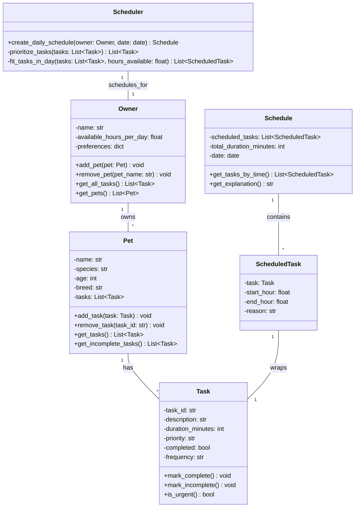

# PawPal+ System UML Diagram

## Key Relationships

- **Owner has many Pets** (1:many) — A pet owner can manage multiple pets
- **Pet has many Tasks** (1:many) — Each pet needs multiple care tasks
- **Scheduler works with Owner** (1:1) — Takes owner data and generates schedules
- **Schedule contains ScheduledTasks** (1:many) — Each schedule is a collection of tasks placed in time slots
- **ScheduledTask wraps Task** — Adds timing and reasoning to a base task

## Design Rationale

- **Task as dataclass** — Simple, immutable data structure for care activities
- **Pet as container** — Organizes tasks by which pet needs them
- **Owner as aggregate** — Central entity that holds all pets and provides access to global constraints
- **Scheduler as utility** — Stateless logic engine that takes owner state and produces schedules
- **Schedule as result object** — Captures the output (what tasks, when, why) so it can be explained and displayed
