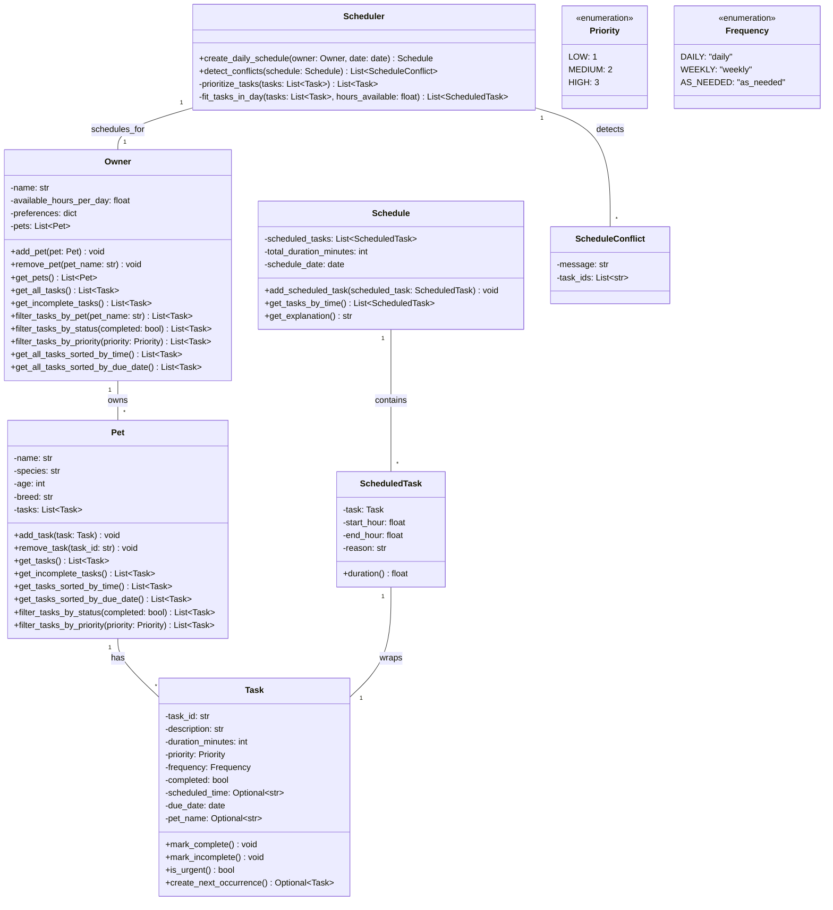

# PawPal+ Final System UML Diagram

This diagram represents the final implementation after all 6 phases, including the smart algorithms added in Phase 4.



## Key Changes from Phase 1 to Final Implementation

### Task Class Enhancements (Phase 4)
- **New Fields**:
  - `scheduled_time: Optional[str]` - Allows sorting by time (HH:MM format)
  - `due_date: date` - Tracks when task should be completed
  - `pet_name: Optional[str]` - References the pet for filtering
- **New Methods**:
  - `create_next_occurrence()` - Auto-generates next daily/weekly task

### Pet Class Enhancements (Phase 4)
- **New Methods**:
  - `get_tasks_sorted_by_time()` - Sort tasks chronologically
  - `get_tasks_sorted_by_due_date()` - Sort by due date
  - `filter_tasks_by_status()` - Get complete/incomplete tasks
  - `filter_tasks_by_priority()` - Get tasks by priority level

### Owner Class Enhancements (Phase 4)
- **New Methods** (cross-pet operations):
  - `filter_tasks_by_pet()` - Query tasks for specific pet
  - `filter_tasks_by_status()` - Global status filtering
  - `filter_tasks_by_priority()` - Global priority filtering
  - `get_all_tasks_sorted_by_time()` - All tasks chronologically
  - `get_all_tasks_sorted_by_due_date()` - All tasks by date

### Scheduler Class Enhancements (Phase 4)
- **New Class**: `ScheduleConflict` - Represents a scheduling conflict
- **New Method**: `detect_conflicts()` - Identifies overlapping tasks

## Design Patterns Used

1. **Dataclass Pattern**: Clean immutable data structures with minimal boilerplate
2. **Strategy Pattern**: Different sorting and filtering strategies via lambda functions
3. **Factory Pattern**: Task creation for recurring occurrences via `create_next_occurrence()`
4. **Observer Pattern**: UI reacts to task/schedule changes via Streamlit session state
5. **Adapter Pattern**: Converts time strings (HH:MM) to sortable integers

## Architecture Layers

```
┌─────────────────────────────────────────┐
│    Presentation Layer (Streamlit UI)    │
│  - Task filtering and sorting UI        │
│  - Schedule display with warnings       │
│  - Conflict detection alerts            │
└──────────────────┬──────────────────────┘
                   │
┌──────────────────▼──────────────────────┐
│    Business Logic Layer (pawpal_system) │
│  - Data models (Task, Pet, Owner)       │
│  - Scheduling algorithms                │
│  - Sorting and filtering operations     │
│  - Conflict detection logic             │
└─────────────────────────────────────────┘
```

## Algorithm Complexity

| Operation | Complexity | Note |
|-----------|-----------|------|
| Sort by time | O(n log n) | Using Python's built-in sort |
| Filter by status | O(n) | Single pass through tasks |
| Create schedule | O(n log n) | Priority sort + greedy fit |
| Detect conflicts | O(n²) | Pairwise comparison |
| Daily recurrence | O(1) | Single task copy + date add |

## Trade-offs Made

1. **Conflict Detection**: Only checks exact time matches (O(n²)) instead of overlapping windows (more complex but better accuracy)
2. **Sorting Strategy**: Uses lambda functions for readability over performance
3. **Task Recurrence**: Stores copies of tasks rather than templates (more memory for simpler logic)
4. **Scheduler Algorithm**: Greedy approach (simpler, predictable) vs optimal assignment (more complex)

## Future Architecture Considerations

If the system grows:
- **Persistence Layer**: Add database models for Owner/Pet/Task persistence
- **API Layer**: REST API for multi-user scenarios
- **Cache Layer**: Task sorting results for repeated queries
- **Event Queue**: Background processing for reminders/notifications
- **Analytics Layer**: Track completion rates, derive recommendations
