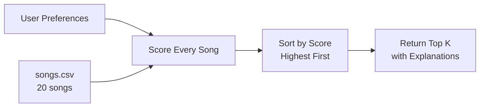
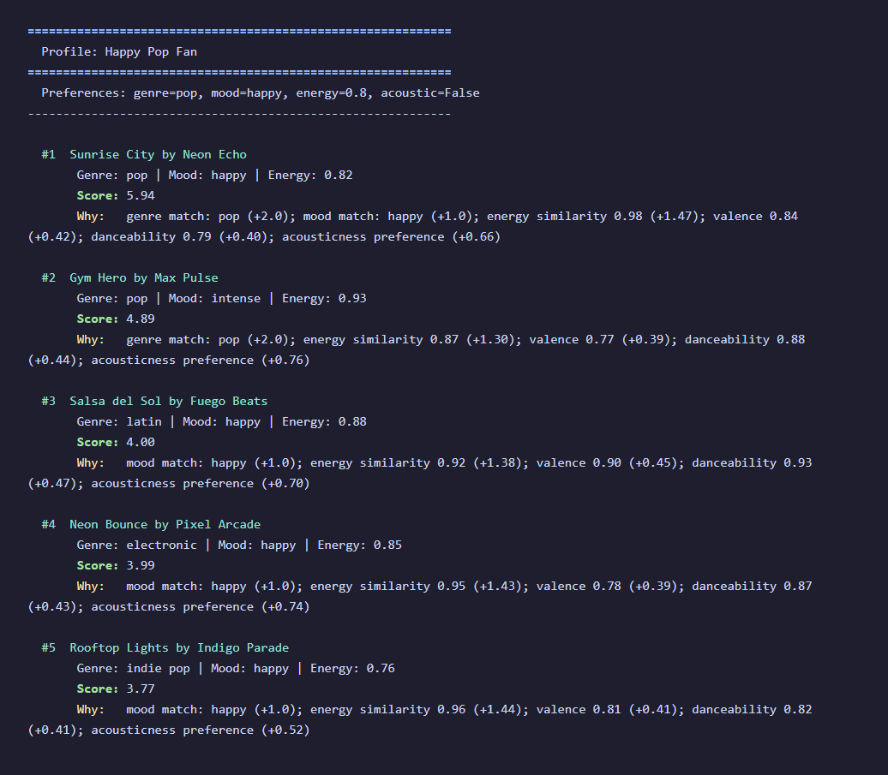
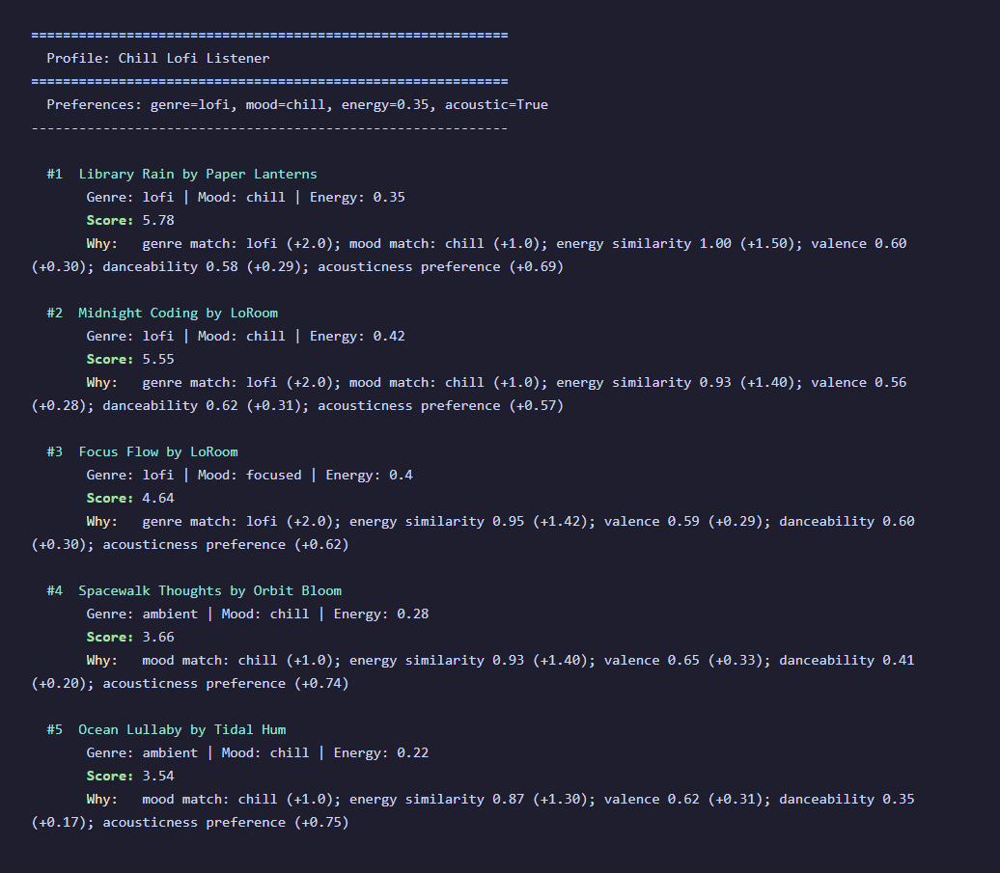
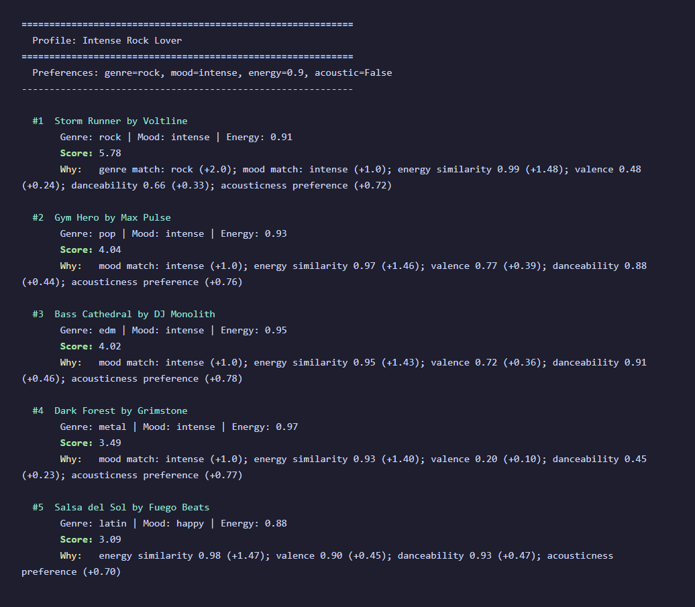
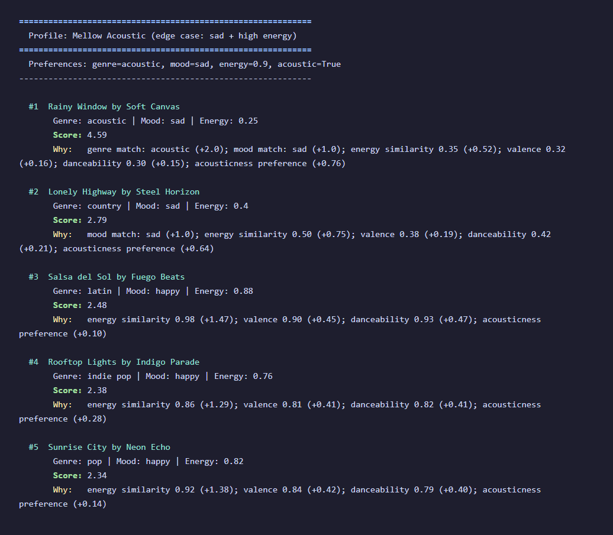
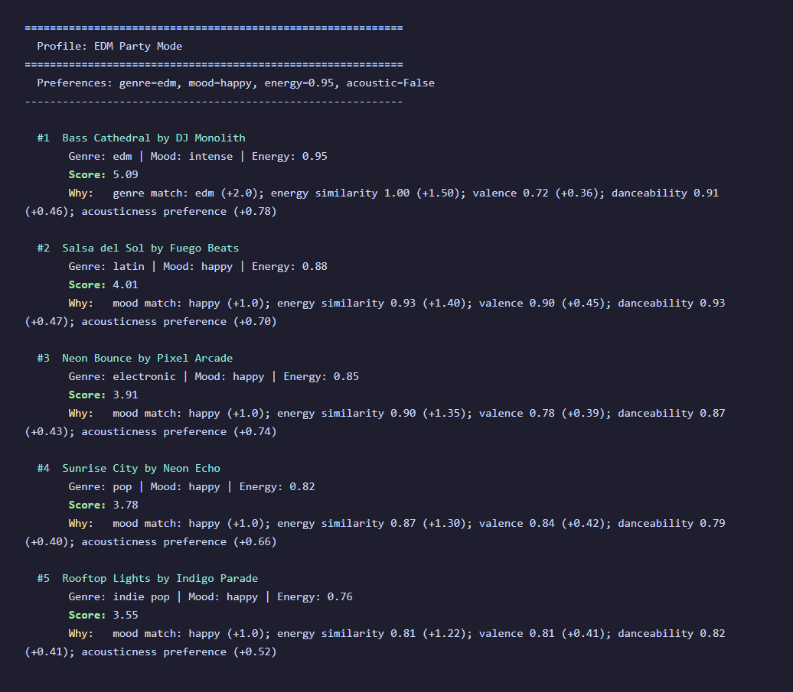
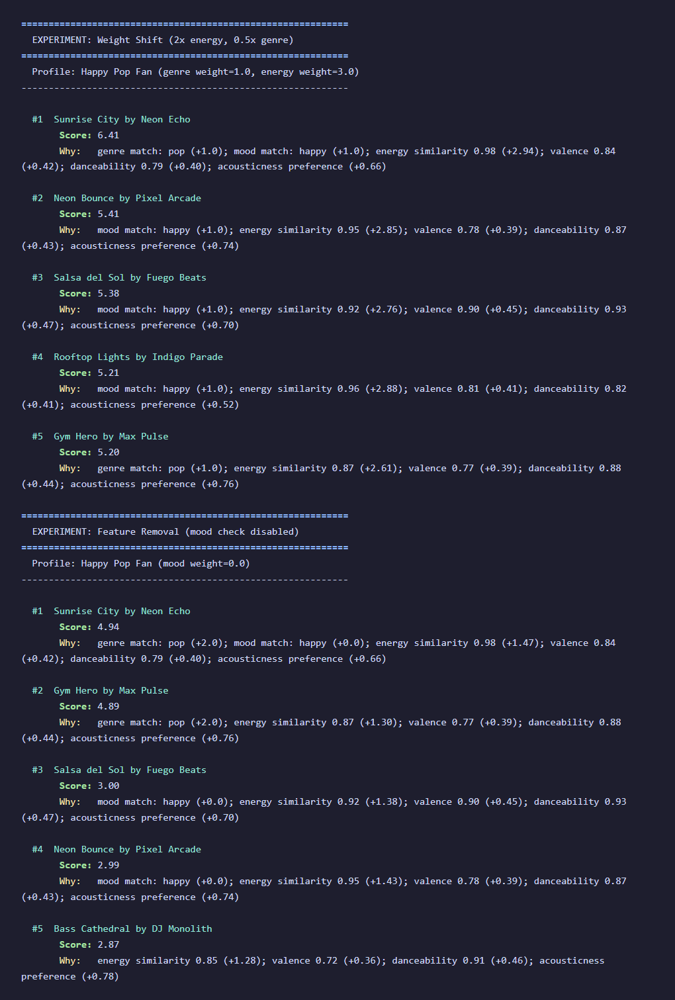

# Music Recommender Simulation

## Project Summary

VibeFinder 1.0 is a content-based music recommender that scores songs against a user's taste profile and returns ranked recommendations with plain-English explanations. It uses a weighted scoring system that considers genre, mood, energy similarity, valence, danceability, and acousticness preference. The system runs entirely from the command line, supports multiple user profiles, and includes sensitivity experiments that demonstrate how tuning weights changes the output.

---

## How The System Works

### How Real-World Recommendations Work

Streaming platforms like Spotify and YouTube use two main approaches to predict what users want to hear next:

- **Collaborative filtering** looks at what other users with similar listening histories enjoyed. If 1,000 users who like the same 50 songs as you also love a 51st song, the system assumes you will like it too. This works well at scale but requires massive amounts of user behavior data.
- **Content-based filtering** looks at the attributes of songs themselves (tempo, energy, genre, mood) and finds songs that are similar to what the user already likes. This does not need other users' data but can create a "more of the same" echo chamber.

Real platforms combine both approaches (hybrid filtering) and add additional signals like time of day, device type, skip rate, and playlist context.

### What VibeFinder 1.0 Does

This simulator uses **content-based filtering** only. It compares each song's attributes against a user's stated preferences and computes a numeric score.

### Features Used

**Song attributes** (from `data/songs.csv`):
| Feature | Type | Description |
|---------|------|-------------|
| genre | categorical | Music genre (pop, lofi, rock, etc.) |
| mood | categorical | Emotional tone (happy, chill, intense, etc.) |
| energy | float 0-1 | Perceived intensity and activity |
| valence | float 0-1 | Musical positiveness (happy vs sad) |
| danceability | float 0-1 | How suitable for dancing |
| acousticness | float 0-1 | Confidence the track is acoustic |

**UserProfile preferences**:
- `favorite_genre` — preferred genre (string)
- `favorite_mood` — preferred mood (string)
- `target_energy` — desired energy level (float 0-1)
- `likes_acoustic` — acoustic preference (boolean)

### Algorithm Recipe (Scoring Rule)

For each song, the system computes:

```
score = genre_match * 2.0
      + mood_match * 1.0
      + (1.0 - |song_energy - target_energy|) * 1.5
      + valence * 0.5
      + danceability * 0.5
      + acousticness_preference * 0.8
```

Where:
- `genre_match` = 1 if the song's genre equals the user's favorite, else 0
- `mood_match` = 1 if the song's mood equals the user's favorite, else 0
- Energy similarity rewards songs **closer** to the target (not just higher or lower)
- Acousticness preference = `acousticness` if user likes acoustic, else `1.0 - acousticness`

Genre gets the highest weight (2.0) because genre is typically the strongest signal in music taste. Energy similarity (1.5) is second because "vibe" often comes down to energy level. Mood (1.0) adds refinement. Valence, danceability, and acousticness are secondary signals.

**Known biases**: This system will over-prioritize genre matching, potentially ignoring great songs from adjacent genres. Songs with high danceability and valence have a built-in advantage regardless of user preferences.

### Data Flow



---

## Getting Started

### Setup

1. Create a virtual environment (optional but recommended):

   ```bash
   python -m venv .venv
   source .venv/bin/activate      # Mac or Linux
   .venv\Scripts\activate         # Windows
   ```

2. Install dependencies:

   ```bash
   pip install -r requirements.txt
   ```

3. Run the app:

   ```bash
   python -m src.main
   ```

### Running Tests

```bash
pytest
```

Tests are in `tests/test_recommender.py` and verify that the OOP `Recommender` class returns songs sorted by score and produces non-empty explanations.

---

## Terminal Output Screenshots

### Profile: Happy Pop Fan


### Profile: Chill Lofi Listener


### Profile: Intense Rock Lover


### Profile: Mellow Acoustic (Edge Case)


### Profile: EDM Party Mode


### Sensitivity Experiments


---

## Experiments You Tried

### Experiment 1: Weight Shift (2x energy, 0.5x genre)

I doubled the energy weight from 1.5 to 3.0 and halved the genre weight from 2.0 to 1.0. For the Happy Pop Fan profile:

- Neon Bounce jumped from #4 to #2 because its energy (0.85) is very close to the 0.8 target.
- Gym Hero dropped from #2 to #5 because its 0.93 energy is further from the target, and the reduced genre bonus no longer compensated.
- The recommendations became more "vibe-accurate" (energy-focused) but less "genre-loyal."

### Experiment 2: Feature Removal (mood disabled)

I set the mood weight to 0.0. For the Happy Pop Fan profile:

- The gap between pop and non-pop songs widened. Sunrise City and Gym Hero held their positions.
- Salsa del Sol's score dropped from 4.00 to 3.00 because it lost the happy mood match bonus.
- Mood was acting as a "cross-genre bridge," letting non-pop happy songs compete. Without it, the system became a pure genre-first recommender with a tighter filter bubble.

### Experiment 3: Edge-Case User (sad + high energy)

The "Mellow Acoustic" profile (genre=acoustic, mood=sad, energy=0.9) tested contradictory preferences. Rainy Window (energy 0.25) still ranked #1 because genre+mood matches contributed 3.0 points, overwhelming the poor energy similarity (0.52 points). This revealed that categorical matches dominate numerical similarity in the current weighting.

---

## Limitations and Risks

- The catalog has only 20 songs, so some genres have just one representative. A "metal" fan gets exactly one metal recommendation.
- The system does not understand lyrics, language, or cultural context.
- Genre matching is exact string comparison: "electronic" and "edm" are treated as completely unrelated.
- High-danceability, high-valence songs (like Salsa del Sol) appear in many profiles due to their strong baseline scores, creating popularity bias.
- The system has no diversity mechanism — all top 5 can be from the same genre/mood.
- Categorical preferences (genre, mood) overpower numerical features, which can produce counterintuitive results for edge-case profiles.

See the full analysis in the [Model Card](model_card.md).

---

## Reflection

Read and complete `model_card.md`:

[**Model Card**](model_card.md)

[**Detailed Reflection with Profile Comparisons**](reflection.md)

Building this recommender taught me that recommendation systems are fundamentally just scoring functions. Every song gets a number, the numbers get sorted, and the top results become "recommendations." The magic is not in some mysterious intelligence but in the choice of features, the weighting, and the data.

The most important lesson was about bias. When 60% of the scoring comes from just two categorical features (genre and mood), the system creates filter bubbles by design. A user who says they like "pop" will never be shown a great lofi track, even if the energy and mood are a perfect match. Real platforms deal with this by adding exploration mechanisms and diversity constraints, but the underlying tension between relevance and discovery is real and hard to solve.

What surprised me was how quickly you stop questioning the recommendations. When Sunrise City shows up as #1 for a pop/happy user, it *feels* right, and you stop asking whether there might be a better song that the system's weights are hiding. That is the same dynamic that plays out at scale with Spotify's Discover Weekly or YouTube's autoplay. The system's confidence is infectious, even when the underlying logic is just weighted addition.
